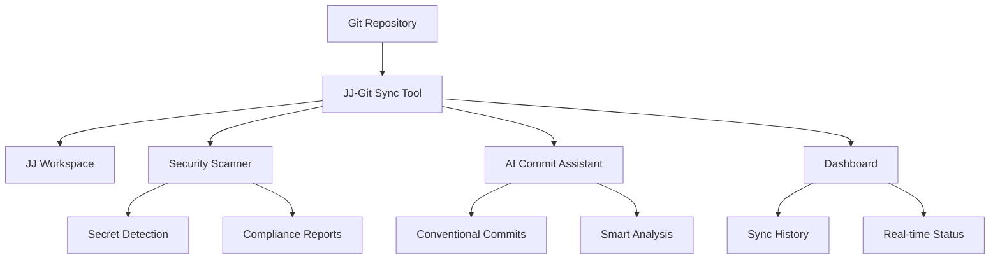

# JJ–Git Sync Tool (PoC)

[](https://python.org)
[](LICENSE)
[](https://github.com/jj-vcs/jj)
[](#security-scanning)
[](#ai-commit-assistant)

A proof-of-concept tool to sync branches and commits between [JJ](https://github.com/jj-vcs/jj) and Git, with built-in security scanning and AI-powered commit assistance.

## 🚀 Quick Start

```bash
# Install dependencies
pip install -r requirements.txt

# Run dashboard
python sync.py dashboard

# Security scan
python sync.py scan

# AI commit suggestions
python sync.py suggest-message
```

## 📊 Workflow Overview



## Features

### Week 1 ✅
- Export JJ commits into Git
- Import Git commits into JJ
- List Git branches

### Week 2 ✅
- **Security Scanning**: Detect secrets in commits (API keys, passwords, tokens)
- **Compliance Reporting**: Human-readable and JSON output formats
- **CI Integration**: JSON output for automated pipelines
- **Severity Levels**: Critical, High, Medium, Low classification
- **Multiple Scan Modes**: Recent commits, specific commit, or integrated with sync

### Week 3 ✅
- **AI Commit Assistant**: Generate intelligent commit messages from git diffs
- **Multiple Styles**: Conventional commits, semantic commits, simple messages
- **Fallback Mode**: Works without external APIs using local analysis
- **LLM Integration**: Ready for OpenAI, Anthropic, and other providers
- **Interactive Mode**: Guided commit message generation
- **Smart Analysis**: Detects file types, change patterns, and semantic meaning

### Week 4 ✅
- **CLI Dashboard**: Beautiful terminal interface with Rich formatting
- **Real-time Status**: Live sync history, security scans, and AI suggestions
- **Demo Ready**: Complete workflow demonstration in under 2 minutes
- **Enhanced Error Handling**: Clear messages and graceful fallbacks
- **Documentation**: Comprehensive demo guide and visual diagrams

## Project Structure
```
jj-git-sync-tool/
├── README.md
├── requirements.txt
├── sync.py              # Main CLI application
├── scanners/
│   └── secrets.py       # Security scanning (Week 2)
└── ai/
    └── commitgen.py     # AI commit assistant (Week 3)
```

## Installation

1. Clone the repository
2. Install dependencies:
   ```bash
   pip install -r requirements.txt
   ```

## Prerequisites

- Python 3.7+
- [JJ](https://github.com/jj-vcs/jj) installed and in your PATH
- Git installed

## Usage

### Sync between JJ and Git
```bash
# Basic sync
python sync.py sync --git-dir /path/to/git --jj-dir /path/to/jj

# Sync with security scan
python sync.py sync --git-dir /path/to/git --jj-dir /path/to/jj --scan

# Sync with JSON security report (for CI)
python sync.py sync --git-dir /path/to/git --jj-dir /path/to/jj --scan --scan-format json
```

### Security Scanning
```bash
# Scan recent commits (default: last 5)
python sync.py scan --git-dir /path/to/git

# Scan specific number of commits
python sync.py scan --git-dir /path/to/git --commits 10

# Scan specific commit
python sync.py scan --git-dir /path/to/git --commit abc123

# JSON output for CI integration
python sync.py scan --git-dir /path/to/git --format json
```

### AI Commit Assistant
```bash
# Generate commit message suggestions (local analysis)
python sync.py suggest-message --git-dir /path/to/git

# Interactive mode with guided assistance
python sync.py suggest-message --git-dir /path/to/git --interactive

# Generate multiple suggestions
python sync.py suggest-message --git-dir /path/to/git --count 5

# Use different commit message styles
python sync.py suggest-message --git-dir /path/to/git --style semantic

# With external LLM (when API key provided)
python sync.py suggest-message --git-dir /path/to/git --model openai --api-key YOUR_API_KEY
```

### Dashboard
```bash
# Full dashboard with Rich UI
python sync.py dashboard

# Quick status overview
python sync.py dashboard --quick
```

### List Git branches
```bash
python sync.py list-branches --git-dir /path/to/git
```

### Help
```bash
python sync.py --help
python sync.py sync --help
python sync.py scan --help
python sync.py suggest-message --help
python sync.py dashboard --help
python sync.py list-branches --help
```

## Security Scanning

The tool includes comprehensive security scanning capabilities:

### Detected Secret Types
- **API Keys**: AWS, Google, GitHub tokens
- **Passwords**: Various password patterns
- **Database Credentials**: Connection strings and passwords
- **SSH Keys**: Private and public keys
- **JWT Tokens**: Bearer tokens and JWTs
- **Generic Secrets**: Custom secret patterns

### Severity Levels
- 🔴 **CRITICAL**: AWS keys, database passwords, SSH private keys
- 🟠 **HIGH**: API keys, passwords, access tokens
- 🟡 **MEDIUM**: Generic tokens, secrets
- 🟢 **LOW**: SSH public keys

### Output Formats
- **Human**: Detailed, color-coded reports for developers
- **JSON**: Machine-readable format for CI/CD pipelines

## AI Commit Assistant

The tool includes intelligent commit message generation:

### Features
- **Local Analysis**: Works without external APIs using git diff analysis
- **Multiple Styles**: Conventional commits, semantic commits, simple messages
- **Smart Detection**: Identifies file types, change patterns, and semantic meaning
- **Interactive Mode**: Guided assistance for commit message creation
- **LLM Ready**: Prepared for integration with OpenAI, Anthropic, and other providers

### Commit Message Styles
- **Conventional**: `feat(scope): add new feature` (default)
- **Semantic**: `feat(scope): add new feature` (similar to conventional)
- **Simple**: `Add new feature` (plain text)

### Analysis Capabilities
- **File Type Detection**: Recognizes Python, JavaScript, documentation, config files
- **Change Classification**: Identifies additions, deletions, refactoring, bug fixes
- **Scope Detection**: Extracts meaningful scope from file paths
- **Breaking Changes**: Detects potential breaking changes
- **Function Analysis**: Identifies modified functions and classes

## CLI Dashboard

The tool includes a beautiful terminal dashboard built with Rich:

### Features
- **Real-time Status**: Live updates of sync operations, security scans, and AI suggestions
- **Rich UI**: Beautiful colors, tables, and panels for better visibility
- **History Tracking**: Last 5 sync operations with timestamps and status
- **Quick Overview**: Fast status check with `--quick` flag
- **Cross-platform**: Works on all terminals with color support

### Dashboard Sections
- **Sync History**: Recent operations with success/failure status
- **Security Status**: Latest scan results and issue counts
- **AI Assistant**: Recent commit message suggestions and styles

## Demo & Presentation

The tool is designed for live demonstrations:

- **📋 Demo Guide**: See `demo.md` for complete step-by-step workflow
- **⏱️ Time**: Complete demo runs in under 2 minutes
- **🎯 Focus**: Showcases all major features efficiently
- **🛡️ Fallbacks**: Graceful handling when JJ is not installed

## Development

This is a modular design to support future extensions:

- `sync.py`: Main CLI interface with basic sync functionality
- `scanners/`: Security scanning modules (placeholder for Week 2)
- `ai/`: AI-powered commit assistance (placeholder for Week 3)

## License

MIT License